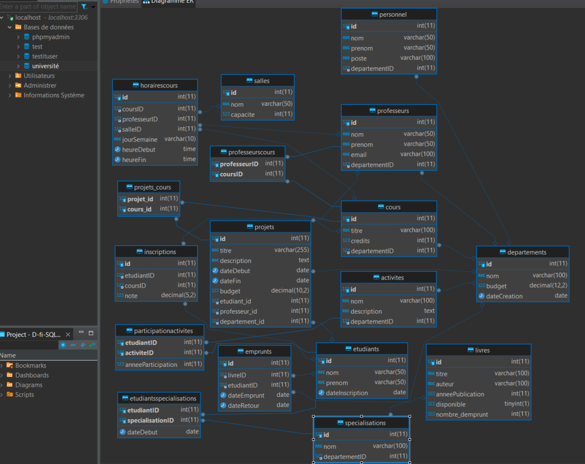

## Manipulation d'une base de donnée plus complexe avec DBeaver
 - 3 niveaux de difficulté
 - Niveau 1 : Utilisation du SELECT et INSERT
 - Niveau 2 : Utilisation des principales fonctions de SQL, GROUP BY, AVG(), COUNT(), MAX(), NULL, ALTER TABLE
 - Niveau 3 : Utilisation de requêtes imbriquées

**Les scripts utilisés sont tous repertoriés dans le dossier Scripts**

